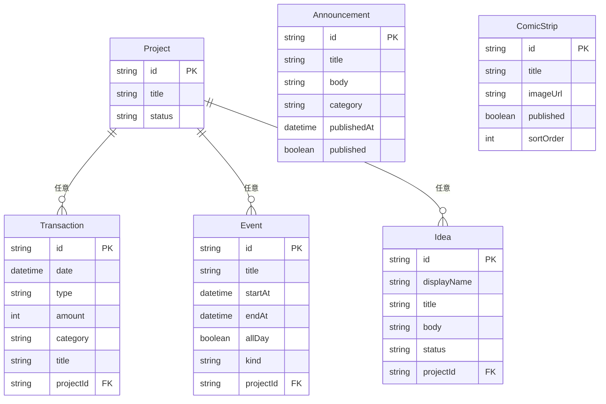

# データモデル

正本のスキーマは `prisma/schema.prisma`（PostgreSQL / Supabase）。
科目・区分のラベルは `lib/categories.ts`。

テーブルを変える実装のときは、先にこのファイルを更新してからコードを直す。

## 共通列

どのテーブルも `id`（cuid）、`createdAt`、`updatedAt` を持つ。

## Project

金策企画の束。取引・予定・視聴者案を任意で紐づける。

| 列 | 型 | 必須 | 値 |
|----|----|------|-----|
| title | text | yes | 企画名 |
| status | text | yes | `planned` / `active` / `completed`（既定 `planned`） |
| overview | text | no | 企画の概要。詳細ページでは結果・明細カードの下の別カードに出す |
| masterNote | text | no | マスターが介入した内容。公開する |
| links | json | no | 外部リンクの配列 `{ kind: youtube/note/other, label, url }`。仕組みの説明はここに貼る |

## Transaction

取引。金額は円の整数。集計の一次データ。

| 列 | 型 | 必須 | 値 |
|----|----|------|-----|
| date | timestamptz | yes | 取引日 |
| type | text | yes | `income` / `expense` / `loan` / `repay` / `capex` |
| amount | int | yes | 円。常に正の整数 |
| category | text | yes | 下表 |
| title | text | yes | 摘要 |
| memo | text | no | |
| projectId | text | no | Project |

インデックス: `date`, `type`, `category`

### type と category

| type | 意味 | 使える category |
|------|------|-----------------|
| income | 収入 | `ads` 広告収入 / `superchat` スーパーチャット / `merch` 物販 / `affiliate` アフィリエイト / `support` 支援金 / `ai_hustle` 事業収入 |
| expense | 支出 | `llm_api` 生成AI利用料 / `voice` 音声合成 / `hosting` ホスティング / `tools` ツール / `other` その他 |
| loan | 借入 | `master_loan` マスター借入 |
| repay | 返済 | `master_repay` マスター借入 |
| capex | 機材購入 | `equipment` 機材 |

損益（カレンダー・月次・KPI の収入/支出）は `income` と `expense` だけ。
借入・返済・機材は資金の流れと貸借対照表に入れる。

恒等式（帳簿）: `現金 + 機材 = マスター借入 + 累計収支`

表示の貸借対照表は NMR の時価を両側に足す。`現金 + 機材 + NMR（時価） = マスター借入 + 累計収支 + NMR評価差額`。損益・自給率には入れない。

現金が負になる更新、返済が借入残高を超える更新は Action で拒否する。

## Event

カレンダー予定。

| 列 | 型 | 必須 | 値 |
|----|----|------|-----|
| title | text | yes | |
| startAt | timestamptz | yes | |
| endAt | timestamptz | yes | |
| allDay | bool | yes | 既定 false |
| kind | text | yes | `stream` 配信 / `release` 公開 / `project` 企画 / `other` その他 |
| projectId | text | no | Project |

インデックス: `startAt`, `endAt`

## Idea

視聴者からの金策案。

| 列 | 型 | 必須 | 値 |
|----|----|------|-----|
| displayName | text | yes | 投稿者の表示名 |
| title | text | yes | |
| body | text | yes | |
| status | text | yes | `submitted` 募集中 / `reviewing` 検討中 / `adopted` 採用 / `in_progress` 実施中 / `done` 完了 |
| projectId | text | no | 採用後などに Project へ |

インデックス: `status`, `createdAt`

## Announcement

公開お知らせ。

| 列 | 型 | 必須 | 値 |
|----|----|------|-----|
| title | text | yes | |
| body | text | yes | 本文 |
| category | text | yes | `news` お知らせ / `stream` 配信 / `other` その他 |
| publishedAt | timestamptz | yes | 表示用の日付 |
| coverUrl | text | no | カバー画像の公開URL（Storage または外部） |
| published | bool | yes | false なら公開しない |

インデックス: `publishedAt`, `published`

## ComicStrip

紹介ページの4コマ作品。1行が縦4コマの画像1枚。

| 列 | 型 | 必須 | 値 |
|----|----|------|-----|
| title | text | yes | 作品タイトル |
| imageUrl | text | yes | 4コマ1枚の公開URLまたは `/brand/...` |
| published | bool | yes | false なら公開しない |
| sortOrder | int | yes | 小さいほど上。既定 0 |

インデックス: `published`, `sortOrder`

## 置かないもの

- 視聴者アカウント（企画投稿は都度入力）
- 問い合わせテーブル（Google フォームへ飛ばす）
- セッションテーブル（HMAC Cookie のみ）
